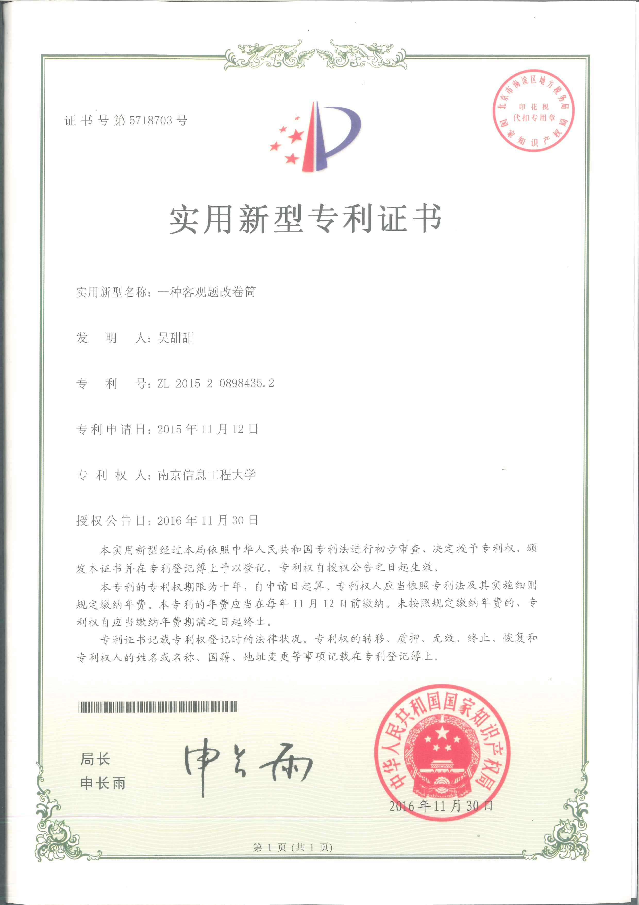

# 我的博客使用 jekyll 静态站技术的 minima 主题

> 注：喜欢minima主题想快速搭建免费域名的小伙伴可以FORK仓库！  
整个修改仓库信息过程大约2分钟左右，而我用服务器搭建ruby环境bundle框架上传仓库则需要半小时。  
- (1) 网页改动 **_config.yml** 文件头中我的账号信息为你的账号信息（可不与github账号一致）.
- (2) 删除或者更改 _posts 文件夹下的 markdown 文章,  
注意文件名需要 “ 年 - 月- 日 - 标题 ” 格式，文件名的日期决定文档的先后排序，不以yml头信息为准。  
- (3) 图片应放"image"文件夹下,引用图片规则与markdown语法一致。
- (4) 最重要的点，把仓库名改为“你的github账号名+.github.io”!例如wutiantian.github.io  

---

# 个人档案
|姓名：吴甜甜 |性别：女|政治面貌：中共党员| 
|:---: | :---: | :---:|  
|学历：硕士|毕业院校：南京信息工程大学|专业：电子信息工程（2017届学士）&&信息工程（硕士）| 
|工作城市：深圳|工作领域：硬件方案设计与高速高密度pcb设计与仿真 | 其他技能：ARM、FPGA、linux操作系统编程|
|个人爱好：参加深圳博览中心、各大路演、沙龙等活动|生活态度：热爱技术、热爱丰富多彩的生活 |才艺：弹奏钢琴、电子琴；打网球；长跑 |
|github博客网址：wutiantian.github.io|码云博客网址：wutiantian52.gitee.io|个人邮箱wutiantian52@outlook.com|

# 我的身份证照片  

